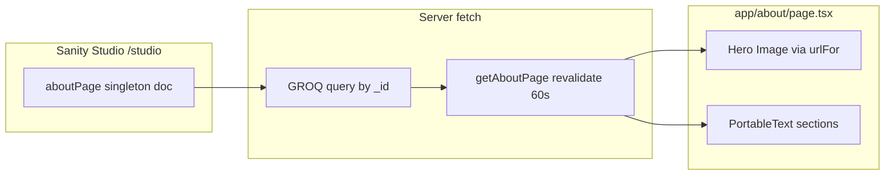

# Agent prompt: Implement About page (same pattern as dragonspurr-web)

Implement a CMS-driven About page for this Next.js app using the same architecture as the **dragonspurr-web** reference project. Content is authored in **Sanity** as a singleton document, fetched server-side with GROQ, and rendered with **Portable Text** and **next/image**.

## Goals

1. **Sanity singleton** — one fixed `aboutPage` document (not a collection); editors manage it at `/studio`.
2. **Server Component page** — fetch content in `app/about/page.tsx` with ISR caching.
3. **Structured sections** — hero portrait + two rich-text sections (`whoWeAre`, `whatWeMake`).
4. **Portable Text rendering** — custom mark styling for emphasis/strong.
5. **Graceful degradation** — helpful messages when Sanity is unconfigured or the document is missing.
6. **Shared design tokens** — reuse site-wide typography/layout utility classes.

---

## 1. Dependencies

Ensure these are installed (versions can match your project's Sanity stack):

```json
"next-sanity": "^12.x",
"@portabletext/react": "^6.x",
"@portabletext/types": "^2.x",
"@sanity/image-url": "^2.x",
"sanity": "^5.x"
```

The About page reads via `app/lib/sanity.ts` (shared Sanity client). The Studio is mounted at `/studio` via `next-sanity/studio`.

---

## 2. Environment variables

Document in `.env.example`:

```bash
# NEXT_PUBLIC_SANITY_PROJECT_ID="xxxxxxx"
# NEXT_PUBLIC_SANITY_DATASET="production"
```

Pattern:

- `NEXT_PUBLIC_SANITY_PROJECT_ID` — required for live content
- `NEXT_PUBLIC_SANITY_DATASET` — defaults to `production` in the client helper

Expose `isSanityConfigured()` that returns `true` only when project ID and dataset are set.

---

## 3. Shared Sanity client (`app/lib/sanity.ts`)

Reference pattern:

```ts
import { createClient } from 'next-sanity';
import { createImageUrlBuilder } from '@sanity/image-url';

export const sanityClient = createClient({
  projectId: projectId || 'build-placeholder',
  dataset,
  apiVersion: '2024-01-01', // or your project's apiVersion
  useCdn: true,
});

export function urlFor(source) {
  return createImageUrlBuilder(sanityClient).image(source);
}

export function isSanityConfigured(): boolean {
  return Boolean(process.env.NEXT_PUBLIC_SANITY_PROJECT_ID && dataset);
}
```

Ensure `next.config.ts` includes `cdn.sanity.io` in `images.remotePatterns` for hero images.

---

## 4. Data layer (`app/lib/about.ts`)

Create a typed fetch helper:

### Types

```ts
export type AboutPageSection = {
  heading: string;
  content: PortableTextBlock[];
};

export type SanityAboutPage = {
  heroImage: {
    asset: SanityImageSource;
    alt: string;
  };
  whoWeAre: AboutPageSection;
  whatWeMake: AboutPageSection;
};
```

### GROQ query (singleton by fixed `_id`)

```groq
*[_id == "aboutPage"][0]{
  heroImage {
    asset,
    alt
  },
  whoWeAre,
  whatWeMake
}
```

### Fetch function

```ts
export async function getAboutPage(): Promise<SanityAboutPage | null> {
  if (!isSanityConfigured()) {
    return null;
  }

  return sanityClient.fetch<SanityAboutPage | null>(
    aboutPageQuery,
    {},
    { next: { revalidate: 60 } },
  );
}
```

- Return `null` when Sanity is not configured (don't throw).
- Use `{ next: { revalidate: 60 } }` for ISR (revalidate every 60 seconds).

---

## 5. Sanity schema (`sanity/schemas/aboutPage.ts`)

Define a **singleton document type** named `aboutPage`:

| Field | Type | Notes |
|---|---|---|
| `heroImage` | `image` with nested `alt` string | Required; hotspot enabled; portrait beside "Who We Are" |
| `whoWeAre` | `object` | `heading` (string) + `content` (array of blocks) |
| `whatWeMake` | `object` | `heading` (string) + `content` (array of blocks) |

### Field details

- **`heroImage.alt`**: required string; set `initialValue` to a sensible default (e.g. founders' names).
- **Section headings**: required strings with `initialValue` (`"Who We Are"`, `"What We Make"`).
- **Section content**: required portable text (`array` of `block` members).
- **Initial content**: provide `initialValue` arrays of portable-text blocks so new documents ship with starter copy (adapt text to the target site).

Helper for seed blocks:

```ts
function portableTextBlock(children: { text: string; marks?: string[] }[]) {
  return {
    _type: 'block',
    style: 'normal',
    markDefs: [],
    children: children.map(({ text, marks = [] }) => ({
      _type: 'span',
      marks,
      text,
    })),
  };
}
```

Use `marks: ['strong', 'em']` on spans that should render bold + italic in the frontend.

### Register schema

Add to `sanity/schemas/index.ts`:

```ts
export const schemaTypes = [aboutPage, /* ...other types */];
```

---

## 6. Sanity Studio singleton structure (`sanity/structure.ts`)

Pin the About page to a fixed document ID so GROQ can query `*[_id == "aboutPage"][0]`:

```ts
const singletonTypes = new Set(['aboutPage']);

export const structure = (S: StructureBuilder) =>
  S.list()
    .title('Content')
    .items([
      S.listItem()
        .title('About Page')
        .child(
          S.document()
            .schemaType('aboutPage')
            .documentId('aboutPage')
            .title('About Page'),
        ),
      S.divider(),
      ...S.documentTypeListItems().filter(
        (listItem) => !singletonTypes.has(listItem.getId() ?? ''),
      ),
    ]);
```

Wire into `sanity.config.ts` via `structureTool({ structure })`.

After deploying schema, create/publish the `aboutPage` document in Studio and upload the hero image.

---

## 7. Page component (`app/about/page.tsx`)

Server Component (async default export). Structure:

### Portable Text components

```tsx
const aboutPortableTextComponents: PortableTextComponents = {
  marks: {
    strong: ({ children }) => <strong className="text-red-600">{children}</strong>,
    em: ({ children }) => <em>{children}</em>,
  },
};
```

Adapt accent color class to the target site's brand token.

### Section subcomponent

```tsx
function AboutSection({ heading, content }: { heading: string; content: PortableTextBlock[] }) {
  return (
    <div className="dp-body-text">
      <strong className="dp-section-header">{heading}</strong>
      <div className="mt-4 [&_p+p]:mt-4">
        <PortableText value={content} components={aboutPortableTextComponents} />
      </div>
    </div>
  );
}
```

### Layout

```tsx
export default async function About() {
  const about = await getAboutPage();

  return (
    <div className="container mx-auto">
      {/* Sanity not configured */}
      {!isSanityConfigured() ? (
        <p className="dp-body-text mb-6">
          Add `NEXT_PUBLIC_SANITY_PROJECT_ID` and `NEXT_PUBLIC_SANITY_DATASET` to start loading
          the About page from Sanity.
        </p>
      ) : null}

      {/* Configured but no document yet */}
      {isSanityConfigured() && !about ? (
        <p className="dp-body-text">
          No About page content yet. Add the About Page document in `/studio`.
        </p>
      ) : null}

      {/* Content */}
      {about ? (
        <div className="grid grid-cols-1 md:grid-cols-2 gap-8 items-start">
          <div className="flex justify-start items-start">
            <Image
              src={urlFor(about.heroImage).width(500).auto('format').url()}
              alt={about.heroImage.alt}
              className="dp-circular-image"
              width={500}
              height={500}
            />
          </div>
          <AboutSection heading={about.whoWeAre.heading} content={about.whoWeAre.content} />
          <AboutSection heading={about.whatWeMake.heading} content={about.whatWeMake.content} />
        </div>
      ) : null}
    </div>
  );
}
```

### Responsive grid behavior

- **Mobile (`grid-cols-1`)**: hero image → Who We Are → What We Make (stacked).
- **Desktop (`md:grid-cols-2`)**: row 1 = hero image | Who We Are; row 2 = What We Make | (empty second column).

---

## 8. Design system CSS classes

Define shared utilities in `app/globals.css` (adapt fonts/colors to target site):

```css
@layer components {
  .dp-section-header {
    @apply font-cinzel_decorative text-2xl md:text-4xl text-[var(--dp-light-red)];
  }

  .dp-circular-image {
    @apply w-full max-w-[500px] h-auto rounded-full;
  }

  .dp-body-text {
    @apply font-cormorant_garamond text-xl md:text-2xl;
  }
}
```

The About page uses:

- `dp-circular-image` — circular hero portrait, max 500px wide
- `dp-section-header` — section headings (Cinzel Decorative, brand accent color)
- `dp-body-text` — body copy (Cormorant Garamond)
- `text-red-600` on `<strong>` marks inside Portable Text

---

## 9. Navigation

Add a nav link in the site header:

```ts
{ href: '/about', label: 'About' }
```

The page inherits layout from the root layout (`Navigation` + `main.dp-main-content` + `Footer`). No About-specific layout file is required.

---

## 10. Optional: page metadata

The reference About page does **not** export `metadata`. For SEO, consider adding (pattern from `app/privacy/page.tsx`):

```ts
export const metadata: Metadata = {
  title: `About | ${siteInfo.name}`,
  description: `Learn about ${siteInfo.name}.`,
};
```

---

## 11. Tests

### `__tests__/app/about/page.test.tsx`

Mock `@/app/lib/about` and `@/app/lib/sanity` (including chained `urlFor().width().auto().url()`).

Test cases:

1. Renders hero image with correct `alt` text
2. Hero `src` uses Sanity image URL builder output
3. Renders bio copy from mocked Portable Text blocks
4. Renders section headings (`Who We Are`, `What We Make`)

Example mock shape:

```ts
const mockAboutPage = {
  heroImage: { asset: { _ref: 'image-about' }, alt: 'Kayt and Ryan' },
  whoWeAre: {
    heading: 'Who We Are',
    content: [{ _type: 'block', children: [{ _type: 'span', text: "Hi! We're Kayt and Ryan!" }] }],
  },
  whatWeMake: {
    heading: 'What We Make',
    content: [{ _type: 'block', children: [{ _type: 'span', text: '...' }] }],
  },
};
```

Render with `render(await About())` since the page is an async Server Component.

### Links smoke test

Include `/about` in any site-wide link integrity test; mock `getAboutPage` so the page renders in CI without a live Sanity dataset.

---

## 12. File layout (reference)

```
app/
  about/page.tsx           # Server Component page
  lib/
    about.ts               # GROQ query + getAboutPage()
    sanity.ts              # shared client, urlFor, isSanityConfigured
sanity/
  schemas/
    aboutPage.ts           # singleton schema + initial content
    index.ts               # register aboutPage type
  structure.ts             # singleton Studio desk item (documentId: aboutPage)
  schemaTypes/index.ts     # export schema for sanity.config
  config.ts                # structureTool({ structure })
app/studio/[[...tool]]/page.tsx   # NextStudio mount
__tests__/app/about/page.test.tsx
```

---

## Adaptation notes for the target project

- Replace dragonspurr-specific copy in schema `initialValue` blocks with the target site's founder story and product description.
- Rename sections if needed (e.g. `ourStory` / `ourServices`) — update types, GROQ projection, schema fields, and page component together.
- Swap font/color utility classes to match the target design system; keep the same component structure.
- If the target site uses a different CMS, preserve the **singleton + server fetch + rich text sections + hero image** pattern; only the schema and query layer change.
- Add page-level `metadata` and Open Graph image from `heroImage` if SEO is a priority.

---

## Reference implementation

The full reference lives in **dragonspurr-web** at:

- `app/about/page.tsx`
- `app/lib/about.ts`
- `app/lib/sanity.ts`
- `sanity/schemas/aboutPage.ts`
- `sanity/structure.ts`
- `sanity/schemas/index.ts`
- `app/globals.css` (`.dp-section-header`, `.dp-circular-image`, `.dp-body-text`)
- `components/Navigation.tsx` (`/about` link)
- `__tests__/app/about/page.test.tsx`
- `next.config.ts` (`images.remotePatterns` for `cdn.sanity.io`)

Match behavior and structure; adapt naming, copy, and styling to the target codebase.

---

## Quick mental model



**Authoring path:** Editor opens `/studio` → About Page singleton → edits hero image + two sections → publish

**Render path:** Request `/about` → `getAboutPage()` → GROQ fetch → grid layout with `next/image` + `PortableText` → HTML

**Fallback path:** No env vars → config message; env set but no doc → Studio prompt message
