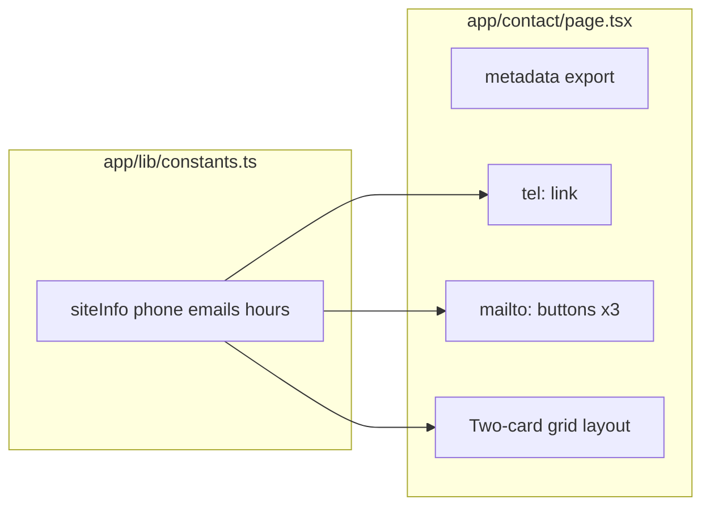

# Agent prompt: Implement Contact page (same pattern as dragonspurr-web)

Implement a static Contact page for this Next.js app using the same architecture as the **dragonspurr-web** reference project. Contact details live in a shared `siteInfo` constants module; the page is a Server Component with a two-card layout (phone + email support). There is **no contact form** — outreach uses `tel:` and `mailto:` links.

## Goals

1. **Centralized contact data** — phone, hours, and support emails in `app/lib/constants.ts` (`siteInfo`).
2. **Static Server Component** — no CMS, no API routes, no client-side form handling.
3. **Two-card responsive grid** — "Talk to us" (phone) and "Contact support" (email buttons).
4. **Accessible links** — `tel:` href with digits only; `mailto:` links with prefilled subjects.
5. **Shared design tokens** — reuse site-wide typography, button, and card styling.
6. **SEO metadata** — page title and description via Next.js `metadata` export.

---

## 1. Dependencies

The Contact page itself has no extra dependencies beyond the app's existing stack. Icons use the shared Iconify wrapper:

```json
"@iconify/react": "^6.x",
"@iconify/types": "^3.x"
```

No Sanity, no form libraries, no email-sending backend.

---

## 2. Site constants (`app/lib/constants.ts`)

Add contact fields to a shared `siteInfo` object (alongside `name`, `url`, `description`):

```ts
const siteInfo = {
  name: "Your Site Name",
  url: "https://example.com",
  productSupportEmail: "support@example.com",
  generalInquiryEmail: "info@example.com",
  billingInquiryEmail: "billing@example.com",
  phone: "+1 (555) 123-4567",
  address: "123 Example St, City, ST 12345",
  hours: "Monday - Friday: 9:00 AM - 5:00 PM",
  description: "...",
};

export { siteInfo /* ... */ };
```

Fields used by the Contact page:

| Field | Usage |
|---|---|
| `phone` | Display text + `tel:` link (digits stripped for href) |
| `hours` | Shown under phone number |
| `productSupportEmail` | Product Support mailto button |
| `generalInquiryEmail` | General Inquiries mailto button |
| `billingInquiryEmail` | Billing Inquiries mailto button |

`address` is defined in constants but not rendered on the Contact page in the reference implementation (available for Footer or future use).

---

## 3. Icon components

### Bundled icons (`components/icons/boxicons-contact.ts`)

Ship only the glyphs needed (avoid importing the full Boxicons set):

```ts
import type { IconifyIcon } from '@iconify/types';

const size = { width: 24, height: 24 } as const;

export const boxiconsContactPhone: IconifyIcon = {
  ...size,
  body: '<path fill="var(--dp-light-red)" d="..." />',
};

export const boxiconsContactEmail: IconifyIcon = {
  ...size,
  body: '<path fill="var(--dp-light-red)" d="..." />',
};
```

Use `fill="var(--dp-light-red)"` (or your brand CSS variable) so icons inherit theme color.

Source SVG paths from [Iconify Boxicons set](https://icon-sets.iconify.design/boxicons/) (`phone-call`, `envelope` or similar).

### Icon wrapper (`components/icons/BoxIcon.tsx`)

Client component wrapping `@iconify/react`:

```tsx
'use client';

import { Icon } from '@iconify/react';
import type { IconifyIcon } from '@iconify/types';

export function BoxIcon({ icon, className, width = '1.25em', height = '1.25em' }) {
  return <Icon icon={icon} className={className} width={width} height={height} aria-hidden />;
}
```

Icons are decorative (`aria-hidden`); link/button text provides accessible labels.

---

## 4. Page component (`app/contact/page.tsx`)

Server Component with metadata and derived link hrefs:

```tsx
import { siteInfo } from '@/app/lib/constants';
import type { Metadata } from 'next';
import { BoxIcon } from '@/components/icons/BoxIcon';
import { boxiconsContactPhone, boxiconsContactEmail } from '@/components/icons/boxicons-contact';

export const metadata: Metadata = {
  title: 'Contact',
  description: 'Get in touch with Your Site Name.',
};

const phoneHref = `tel:${siteInfo.phone.replace(/\D/g, '')}`;
const productSupportMailto = `mailto:${siteInfo.productSupportEmail}?subject=${encodeURIComponent('Product support request')}`;
const generalInquiryMailto = `mailto:${siteInfo.generalInquiryEmail}?subject=${encodeURIComponent('General inquiry')}`;
const billingInquiryMailto = `mailto:${siteInfo.billingInquiryEmail}?subject=${encodeURIComponent('Billing inquiry')}`;

export default function Contact() {
  return (
    <div className="container mx-auto max-w-4xl">
      <h1 className="dp-page-header">Get in touch</h1>
      <p className="dp-body-text text-gray-300 mb-8 md:mb-10">
        Want to reach us? We&apos;d love to hear from you. Here&apos;s how you can get in touch.
      </p>

      <div className="grid grid-cols-1 md:grid-cols-2 gap-6">
        {/* Phone card */}
        <section className="rounded-lg border border-[var(--dp-gray-600)] bg-black/40 p-6 md:p-8 space-y-4">
          <div className="flex justify-center">
            <BoxIcon icon={boxiconsContactPhone} width="4rem" height="4rem" />
          </div>
          <div className="flex justify-center">
            <h2 className="font-cinzel_decorative text-2xl text-[var(--dp-light-red)]">
              Talk to us
            </h2>
          </div>
          <p className="font-cormorant_garamond text-lg md:text-xl text-gray-300">
            Questions about our shop, custom work, or an existing order? Give us a call during
            business hours.
          </p>
          <p>
            <a href={phoneHref} className="dp-link font-cinzel text-xl md:text-2xl">
              {siteInfo.phone}
            </a>
          </p>
          <p className="font-cormorant_garamond text-base text-gray-400">{siteInfo.hours}</p>
        </section>

        {/* Email card */}
        <section className="rounded-lg border border-[var(--dp-gray-600)] bg-black/40 p-6 md:p-8 space-y-4 flex flex-col">
          <div className="flex justify-center">
            <BoxIcon icon={boxiconsContactEmail} width="4rem" height="4rem" />
          </div>
          <div className="flex justify-center">
            <h2 className="font-cinzel_decorative text-2xl text-[var(--dp-light-red)]">
              Contact support
            </h2>
          </div>
          <p className="font-cormorant_garamond text-lg md:text-xl text-gray-300 flex-1">
            Need help with an order, shipping, or your account? Send us a message and we&apos;ll get
            back to you as soon as we can.
          </p>
          <a href={productSupportMailto} className="dp-form-button inline-block text-center w-fit">
            Product Support
          </a>
          <a href={generalInquiryMailto} className="dp-form-button inline-block text-center w-fit">
            General Inquiries
          </a>
          <a href={billingInquiryMailto} className="dp-form-button inline-block text-center w-fit">
            Billing Inquiries
          </a>
        </section>
      </div>
    </div>
  );
}
```

### Link conventions

- **`tel:` href**: strip all non-digits from `siteInfo.phone` → e.g. `+1 (289) 269-2529` becomes `tel:12892692529`
- **`mailto:` href**: include `?subject=` with `encodeURIComponent()` for a prefilled subject line
- Display the human-formatted phone string; use the sanitized href for dialing

### Layout behavior

- **Mobile (`grid-cols-1`)**: phone card stacked above email card
- **Desktop (`md:grid-cols-2`)**: side-by-side cards
- Page container: `max-w-4xl` centered within site layout

---

## 5. Design system CSS classes

Used on the Contact page (define in `app/globals.css`):

```css
:root {
  --dp-light-red: #dc2626;
  --dp-gray-600: #4b5563;
}

@layer components {
  .dp-page-header {
    @apply font-cinzel_decorative text-4xl md:text-[60px] text-[var(--dp-light-red)] leading-none mb-8 md:mb-12;
  }

  .dp-body-text {
    @apply font-cormorant_garamond text-xl md:text-2xl;
  }

  .dp-link {
    @apply text-white no-underline hover:text-[var(--dp-light-red)] target:text-[var(--dp-light-red)];
  }

  .dp-form-button {
    @apply font-cinzel text-lg px-4 py-2 rounded-md bg-[var(--dp-dark-red)] text-white hover:bg-[var(--dp-light-red)];
  }
}
```

Card styling (inline Tailwind on `<section>`):

- `rounded-lg border border-[var(--dp-gray-600)] bg-black/40 p-6 md:p-8`
- Section headings: `font-cinzel_decorative text-2xl text-[var(--dp-light-red)]`
- Body copy: `font-cormorant_garamond text-lg md:text-xl text-gray-300`

Adapt font families and colors to the target site's design tokens.

---

## 6. Navigation

Add a nav link in the site header:

```ts
{ href: '/contact', label: 'Contact' }
```

The page inherits the root layout (`Navigation` + `main.dp-main-content` + `Footer`). No Contact-specific layout file.

---

## 7. Tests

### `__tests__/app/contact/page.test.tsx`

Sync Server Component — render with `render(<Contact />)` (no `await`).

Test cases:

1. **Page heading and intro** — `h1` "Get in touch", intro paragraph visible
2. **Phone link** — link text matches `siteInfo.phone`, `href` is `tel:` + digits only
3. **Support email links** — three buttons with `mailto:` hrefs containing the correct addresses
4. **Business hours** — `siteInfo.hours` text rendered

Example phone assertion:

```ts
const phoneLink = screen.getByRole('link', { name: /\+1 \(289\) 269-2529/i });
expect(phoneLink).toHaveAttribute('href', 'tel:12892692529');
```

Example mailto assertion:

```ts
expect(screen.getByRole('link', { name: /product support/i })).toHaveAttribute(
  'href',
  expect.stringContaining('productsupport@example.com'),
);
```

### Links smoke test (`__tests__/links.test.tsx`)

Include `/contact` in site-wide route coverage. Assert:

- All Contact page links match `/^(https?:\/\/|tel:|mailto:)/`
- At least one `tel:` href and one `mailto:` href present

---

## 8. File layout (reference)

```
app/
  contact/page.tsx              # Server Component page
  lib/constants.ts                # siteInfo with contact fields
components/
  icons/
    BoxIcon.tsx                   # Iconify wrapper (client)
    boxicons-contact.ts           # bundled phone + email icons
__tests__/
  app/contact/page.test.tsx
  links.test.tsx                  # includes /contact link checks
```

---

## What this page deliberately does NOT include

The reference Contact page has **no**:

- Contact form or server action
- Email-sending API route (Resend, SendGrid, etc.)
- Sanity/CMS content
- Google Maps embed (address is in constants but not shown here)
- Client-side JavaScript beyond the icon wrapper

If the target site needs a contact form, that is a separate feature. Keep mailto/tel as the baseline pattern unless explicitly requested.

---

## Adaptation notes for the target project

- Update `siteInfo` emails, phone, and hours for the target business.
- Adjust card copy (intro paragraph, section descriptions) to match tone and services.
- Reduce email buttons if the target site only has one support address (e.g. single `mailto:info@...`).
- Add a third card (address/map, social links) if needed — follow the same card styling pattern.
- Consider aligning Privacy Policy copy: the reference privacy page mentions a "contact form" but the Contact page uses mailto links only.
- For international sites, format `tel:` hrefs per locale (E.164 without spaces is generally safe).

---

## Reference implementation

The full reference lives in **dragonspurr-web** at:

- `app/contact/page.tsx`
- `app/lib/constants.ts` (`siteInfo` contact fields)
- `components/icons/BoxIcon.tsx`
- `components/icons/boxicons-contact.ts`
- `app/globals.css` (`.dp-page-header`, `.dp-body-text`, `.dp-link`, `.dp-form-button`)
- `components/Navigation.tsx` (`/contact` link)
- `__tests__/app/contact/page.test.tsx`
- `__tests__/links.test.tsx` (Contact link smoke tests)

Match behavior and structure; adapt copy, contact details, and styling to the target codebase.

---

## Quick mental model



**User path (phone):** Visit `/contact` → click phone number → device dialer opens

**User path (email):** Visit `/contact` → click support button → default mail client opens with prefilled subject

**Maintenance path:** Edit `siteInfo` in constants → redeploy (no CMS, no env vars required for contact data)
