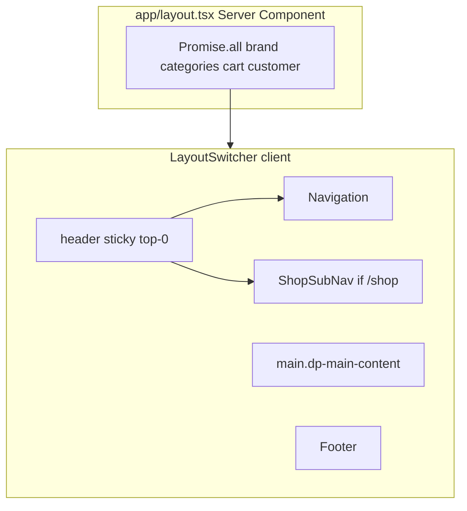

# Agent prompt: Implement Header and Navigation (same pattern as dragonspurr-web)

Implement the site header and navigation for this Next.js app using the same architecture as the **dragonspurr-web** reference project. A **root layout** fetches nav data server-side; a **LayoutSwitcher** client component orchestrates the sticky header; **Navigation** is the primary nav bar; **ShopSubNav** adds shop-specific controls on `/shop/*` routes.

## Goals

1. **Sticky header** — primary nav sticks to top; on shop routes, a single sticky wrapper holds both nav bars.
2. **Server-fetched nav data** — brand links, shop categories, cart preview, and customer session resolved in root layout.
3. **Client nav components** — pathname-aware active states, responsive mobile menu, CSS hover dropdowns.
4. **Brands flyout** — optional Sanity-driven external links under the Brands nav item.
5. **Shop sub-nav** — category browse dropdown, cart preview, account menu (Medusa integration).
6. **Studio bypass** — `/studio` renders without site chrome.

---

## 1. Architecture overview



| Layer | File | Role |
|---|---|---|
| Data | `app/layout.tsx` | Fetch nav props server-side |
| Orchestration | `app/LayoutSwitcher.tsx` | Route-based header/main/footer shell |
| Primary nav | `components/Navigation.tsx` | Logo + site links + mobile menu |
| Shop nav | `components/shop/ShopSubNav.tsx` | Browse, account, cart |
| Account menu | `components/shop/AccountNavDropdown.tsx` | Login, orders, account, logout |
| Cart menu | `components/shop/CartNavDropdown.tsx` | Cart preview + quick actions |

---

## 2. Dependencies

```json
"next": "^16.x",
"@iconify/react": "^6.x",
"@iconify/types": "^3.x",
"next-sanity": "^12.x",
"@medusajs/js-sdk": "^2.x"
```

Shop sub-nav requires Medusa cart/auth helpers. Brands dropdown requires Sanity brand nav query.

---

## 3. Root layout integration (`app/layout.tsx`)

Server Component fetches all nav data in parallel and passes to `LayoutSwitcher`:

```tsx
export default async function RootLayout({ children }: { children: ReactNode }) {
  const [brandNavLinks, shopCategories, cart, customer] = await Promise.all([
    getBrandNavLinks(),       // Sanity → BrandNavItem[]
    listShopCategories(),     // Medusa → ShopCategoryNavItem[]
    getShopCartNavPreview(),  // Medusa cart cookie → ShopCartNavPreview
    retrieveLoggedInCustomer(), // Medusa JWT → customer | null
  ]);

  return (
    <html lang="en" className="...font variables...">
      <body className="bg-black text-white min-h-screen flex flex-col">
        <LayoutSwitcher
          brandNavLinks={brandNavLinks}
          shopCategories={shopCategories}
          cart={cart}
          isCustomerLoggedIn={customer != null}
          customerDisplayName={customer ? getCustomerDisplayName(customer) : null}
          customerAvatarUrl={customer ? getCustomerAvatarProxyUrl(customer) : null}
        >
          {children}
        </LayoutSwitcher>
      </body>
    </html>
  );
}
```

Optional: set `--dp-main-content-bg-image` CSS variable on `<html>` from `logoTypes.publication_banner` for main content background.

---

## 4. LayoutSwitcher (`app/LayoutSwitcher.tsx`)

Client component that switches layout by pathname:

```tsx
'use client';

export function LayoutSwitcher({
  children,
  brandNavLinks = [],
  shopCategories = [],
  cart = emptyCart,
  isCustomerLoggedIn = false,
  customerDisplayName = null,
  customerAvatarUrl = null,
}: LayoutSwitcherProps) {
  const pathname = usePathname();
  const isStudio = pathname?.startsWith('/studio');
  const isShop = pathname?.startsWith('/shop');

  // Sanity Studio: full-screen, no site chrome
  if (isStudio) {
    return (
      <div className="h-screen w-screen overflow-hidden flex flex-col">
        {children}
      </div>
    );
  }

  return (
    <>
      <header className="sticky top-0 z-50 w-full">
        <Navigation brandNavLinks={brandNavLinks} embedded={isShop} />
        {isShop ? (
          <ShopSubNav
            categories={shopCategories}
            cart={cart}
            isCustomerLoggedIn={isCustomerLoggedIn}
            customerDisplayName={customerDisplayName}
            customerAvatarUrl={customerAvatarUrl}
          />
        ) : null}
      </header>
      <main className="dp-main-content">
        <div className="w-full max-w-7xl mx-auto">{children}</div>
      </main>
      <Footer />
    </>
  );
}
```

### Sticky header pattern

- **Non-shop routes:** `Navigation` has `sticky top-0 z-50` on itself.
- **Shop routes:** `Navigation` receives `embedded={true}` (no own sticky/border); parent `<header className="sticky top-0 z-50">` wraps both `Navigation` and `ShopSubNav` so they stick together.

---

## 5. Primary navigation (`components/Navigation.tsx`)

Client component (`'use client'`).

### Nav links

```ts
const navLinks = [
  { href: '/', label: 'Home' },
  { href: '/about', label: 'About' },
  { href: '/brands', label: 'Brands' },
  { href: '/blog', label: 'Blog' },
  { href: '/portfolio', label: 'Portfolio' },
  { href: '/shop', label: 'Shop' },
  { href: '/contact', label: 'Contact' },
];
```

Adapt labels and paths to the target site.

### Props

```ts
type NavigationProps = {
  brandNavLinks?: BrandNavItem[];  // { _id, text, url }
  embedded?: boolean;              // true on shop routes
};
```

### Active link detection

```ts
const isActive = (href: string) => {
  if (pathname == null) return false;
  if (href === '/') return pathname === '/';
  return pathname === href || pathname.startsWith(href + '/');
};
```

- Home: exact match only (`/` not active on `/about`)
- Other routes: exact or prefix match (`/shop` active on `/shop/cart`)

### Link styling

```ts
const linkClass = (active: boolean) =>
  active
    ? 'text-red-600 no-underline hover:text-red-600 focus:text-red-600'
    : 'dp-link';
```

Active links use brand accent color; inactive use `.dp-link` (white, red on hover).

### Logo

- Links to `/`
- `logoTypes.wide_for_dark_bkgds` from constants (proxied site asset)
- `priority` for LCP
- Responsive width: `w-36 sm:w-44 md:w-60`

### Desktop nav (≥1024px)

- `matchMedia('(max-width: 1023px)')` toggles mobile vs desktop
- Desktop links in `<div className="dp-nav-item">` — flex wrap, right-aligned

### Brands dropdown (desktop + mobile)

When `brandNavLinks.length > 0` and `href === '/brands'`:

- Parent link to `/brands` with `aria-haspopup="menu"` and ▾ indicator
- CSS hover/focus dropdown (`group-hover`, `group-focus-within`)
- Menu items are **external** `<a href={url} target="_blank" rel="noreferrer">` from Sanity
- `role="menu"` / `role="menuitem"` for accessibility

Data source (`app/lib/brands.ts`):

```groq
*[_type == "brand"] | order(displayOrder asc) {
  _id,
  "text": brandTitle.text,
  "url": brandTitle.url,
}
```

Returns `[]` when Sanity is not configured.

### Mobile hamburger (≤1023px)

- Hamburger button: `aria-label="Open navigation menu"`, `aria-expanded={menuOpen}`
- Three-bar icon (CSS spans)
- Dropdown panel: absolute, right-aligned, `border-red-800 bg-black/95`
- All nav links stacked vertically; brands sub-links indented with left border
- `onClick={() => setMenuOpen(false)}` on each link to close menu
- Auto-close when resizing to desktop

### Nav bar styling

```tsx
<nav className={`bg-black w-full flex justify-center pt-2.5 md:pr-[100px] pb-2 px-3 md:px-0 ${
  embedded ? '' : 'sticky top-0 z-50 border-b-2 border-red-800'
}`}>
  <div className="w-full max-w-7xl flex items-center justify-between gap-3 md:gap-6">
    {/* logo + links or hamburger */}
  </div>
</nav>
```

---

## 6. Shop sub-navigation (`components/shop/ShopSubNav.tsx`)

Rendered only when `pathname.startsWith('/shop')`. Dark red bar below primary nav.

### Props

```ts
type ShopSubNavProps = {
  categories?: ShopCategoryNavItem[];  // { id, name, handle }
  cart?: ShopCartNavPreview;
  isCustomerLoggedIn?: boolean;
  customerDisplayName?: string | null;
  customerAvatarUrl?: string | null;
};
```

### Layout

```tsx
<nav aria-label="Shop" className="w-full flex justify-center bg-[var(--dp-dark-red)] border-b-2 border-red-800">
  <ul className="w-full max-w-7xl flex flex-wrap items-center gap-6 md:gap-10 py-2.5 px-3 md:px-0">
    <li>{/* Browse dropdown */}</li>
    <li className="ml-auto flex items-center gap-2 md:gap-3">
      <AccountNavDropdown ... />
      <CartNavDropdown ... />
    </li>
  </ul>
</nav>
```

### Browse dropdown

- Link to `/shop` labeled "Browse" with ▾
- Active when `pathname === '/shop'` or `pathname.startsWith('/shop/category/')`
- Dropdown menu:
  - "All products" → `/shop`
  - Each category → `/shop/category/{handle}`
  - Empty state: "No categories yet"

Categories from `listShopCategories()` in `app/lib/shop.ts` (Medusa Store API).

---

## 7. Account dropdown (`components/shop/AccountNavDropdown.tsx`)

### Trigger

- Button with user icon (`boxiconsUserCircle` / filled when logged in)
- `aria-label="Account menu"`, `aria-haspopup="menu"`

### Menu items

| State | Items |
|---|---|
| Logged out | Login or create account → `/shop/login` |
| Logged in | Header with avatar/initials + display name |
| Always | Order history → `/shop/orders` |
| Always | Manage account → `/shop/account` |
| Always | Log out → `<form action={logoutAction}>` server action |

### Active state

`isAccountActive` is true for `/shop/account`, `/shop/orders`, `/shop/login`, `/shop/signup`.

### Avatar display

- Proxy URL from `getCustomerAvatarProxyUrl(customer)` (same-origin `/api/shop/avatar/...`)
- Fallback: initials from display name (first letters of up to 2 words)

---

## 8. Cart dropdown (`components/shop/CartNavDropdown.tsx`)

### Trigger

- Cart icon link to `/shop/cart` with item count badge
- Filled icon when `cart.itemCount > 0`
- `aria-label`: "Cart" or "Cart, N items"
- ▾ indicator for dropdown affordance

### Preview panel

| State | Content |
|---|---|
| Empty | "Your cart is empty." + View cart link |
| Has items | Scrollable line items (thumbnail, title, variant, price, quantity controls) + total + View cart + Checkout |

### Line item interactions

- `CartQuantityControls` calls `updateCartLineItemAction` server action
- On success: `router.refresh()` to update server-fetched cart in layout
- Error message shown inline in dropdown

### Cart data (`app/lib/medusa-cart.ts`)

```ts
export type ShopCartNavPreview = {
  itemCount: number;
  items: ShopCartNavItem[];
  total: number | null;
  currencyCode: string | null;
};

export async function getShopCartNavPreview(): Promise<ShopCartNavPreview> {
  // Read cart ID from cookie → retrieve from Medusa → map to preview shape
  // Returns empty preview if Medusa unconfigured or no cart
}
```

Safe for Server Components (read-only; does not create carts).

---

## 9. Shared dropdown pattern

All flyout menus (Brands, Browse, Account, Cart) use the same CSS pattern:

```tsx
<div className="group relative inline-block">
  <trigger />
  <div className="pointer-events-none absolute ... top-full z-[60] pt-1
                  opacity-0 invisible transition-opacity duration-150
                  group-hover:pointer-events-auto group-hover:opacity-100 group-hover:visible
                  group-focus-within:pointer-events-auto group-focus-within:opacity-100 group-focus-within:visible">
    <ul role="menu" className="rounded-md border border-red-800 bg-black/95 py-2 shadow-lg">
      ...
    </ul>
  </div>
</div>
```

- Hover and keyboard focus (`group-focus-within`) reveal menu
- `z-[60]` above page content
- Dark semi-transparent panel with red border

---

## 10. Design system CSS

From `app/globals.css`:

```css
:root {
  --dp-light-red: #dc2626;
  --dp-dark-red: #991b1b;
  --dp-gray-600: #4b5563;
  --dp-gray-800: #1f2937;
}

@layer components {
  .dp-link {
    @apply text-white no-underline hover:text-[var(--dp-light-red)] target:text-[var(--dp-light-red)];
  }

  .dp-nav-item {
    @apply flex flex-wrap justify-end gap-2 md:gap-3 font-cinzel text-white text-base md:text-xl;
  }

  .dp-main-content {
    @apply flex-1 flex justify-center items-start md:items-center pt-12 px-4 pb-28 md:pb-24
      bg-cover bg-center bg-fixed bg-[var(--dp-gray-800)] bg-blend-soft-light;
    background-image: var(--dp-main-content-bg-image);
  }
}
```

Nav-specific inline styles:

- Primary nav: `bg-black`, `border-b-2 border-red-800`
- Shop sub-nav: `bg-[var(--dp-dark-red)]`, `border-b-2 border-red-800`
- Mobile menu button: `border border-red-800 hover:bg-red-950/40`

---

## 11. Icon components

Bundle icons in `components/icons/boxicons-cart.ts` (avoid shipping full icon set):

| Icon | Usage |
|---|---|
| `boxiconsUserCircle` / `boxiconsUserCircleFilled` | Account menu |
| `boxiconsCart` / `boxiconsCartFilled` | Cart menu |
| `boxiconsArrowBigLeft/Right` (+ filled) | Portfolio pagination (separate) |

Wrapper: `components/icons/BoxIcon.tsx` — client component using `@iconify/react`, `aria-hidden`.

---

## 12. Tests

### `__tests__/components/Navigation.test.tsx`

```ts
describe('Navigation', () => {
  it('renders the logo with correct alt text', () => { ... });
  it('renders navigation links', () => {
    // Home, About, Brands, Blog, Portfolio, Contact, Shop
  });
  it('links to correct internal paths', () => {
    // href="/", "/about", "/blog", "/contact", "/shop"
  });
  it('Shop link is an internal route (not external)', () => {
    expect(shopLink).not.toHaveAttribute('target', '_blank');
  });
});
```

### `__tests__/links.test.tsx`

- All Navigation `href` values are valid internal paths or `https://` externals
- Navigation contains expected paths: `/`, `/about`, `/brands`, `/blog`, `/portfolio`, `/contact`, `/shop`

### Shop nav tests (add if implementing shop)

Mock `usePathname`, cart preview, and server actions when testing `ShopSubNav`, `AccountNavDropdown`, `CartNavDropdown`.

---

## 13. File layout (reference)

```
app/
  layout.tsx                    # Fetch nav data, render LayoutSwitcher
  LayoutSwitcher.tsx            # Header/main/footer shell
  lib/
    brands.ts                   # getBrandNavLinks()
    shop.ts                     # listShopCategories()
    medusa-cart.ts              # getShopCartNavPreview()
    medusa-auth.ts              # retrieveLoggedInCustomer()
    customer-display.ts         # getCustomerDisplayName()
    customer-avatar.ts          # getCustomerAvatarProxyUrl()
    constants.ts                # logoTypes
components/
  Navigation.tsx
  shop/
    ShopSubNav.tsx
    AccountNavDropdown.tsx
    CartNavDropdown.tsx
    CartQuantityControls.tsx
  icons/
    BoxIcon.tsx
    boxicons-cart.ts
__tests__/
  components/Navigation.test.tsx
  links.test.tsx
```

---

## Adaptation notes for the target project

- Trim `navLinks` to routes the target site actually has.
- Skip `ShopSubNav` and related dropdowns if no Medusa shop — remove shop data fetching from layout.
- Skip brands dropdown if no Sanity brands — `brandNavLinks` defaults to `[]`, Brands renders as a simple link.
- Adjust mobile breakpoint (`1023px`) if your design needs a different threshold.
- Consider `usePathname` SSR: component is client-only, so no hydration issues for active states.
- For sites without `/studio`, remove the `isStudio` branch or point it at your CMS path.
- Cart dropdown requires server actions (`updateCartLineItemAction`, `logoutAction`) — implement shop actions first or simplify cart to link-only.

---

## What this deliberately does NOT include

- Footer component (rendered by LayoutSwitcher but separate from header/nav)
- Shop sub-pages (cart, checkout, account) beyond nav integration
- Search bar or mega-menu
- Animated mobile drawer / slide-out (uses simple absolute dropdown)
- Third-party nav libraries

---

## Reference implementation

The full reference lives in **dragonspurr-web** at:

- `app/layout.tsx`
- `app/LayoutSwitcher.tsx`
- `components/Navigation.tsx`
- `components/shop/ShopSubNav.tsx`
- `components/shop/AccountNavDropdown.tsx`
- `components/shop/CartNavDropdown.tsx`
- `app/lib/brands.ts`
- `app/lib/shop.ts` (`listShopCategories`)
- `app/lib/medusa-cart.ts` (`getShopCartNavPreview`)
- `app/globals.css` (`.dp-link`, `.dp-nav-item`, `.dp-main-content`)
- `__tests__/components/Navigation.test.tsx`
- `__tests__/links.test.tsx`

Match behavior and structure; adapt nav links, styling, and data sources to the target codebase.

---

## Quick mental model

**Data flow:** Root layout (server) fetches brands + categories + cart + customer → passes props to LayoutSwitcher (client) → Navigation + optional ShopSubNav

**Route behavior:**

| Path | Header |
|---|---|
| `/studio/*` | No header (full-screen Studio) |
| `/shop/*` | Sticky header: Navigation (`embedded`) + ShopSubNav |
| Everything else | Sticky Navigation only |

**Interaction flow:** User hovers/focuses nav item → CSS group reveals dropdown → click link or external URL → mobile: hamburger toggles stacked menu
