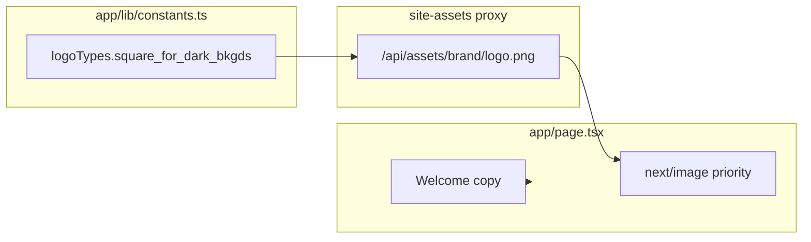

# Agent prompt: Implement Home page (same pattern as dragonspurr-web)

Implement a static landing page for this Next.js app using the same architecture as the **dragonspurr-web** reference project. The home page is a Server Component with a two-column hero layout: brand logo on the left, welcome tagline on the right. No CMS, no API routes, no client-side JavaScript.

## Goals

1. **Static Server Component** — no data fetching, no env vars required for page content.
2. **Brand assets from constants** — logo URL built via the site-assets proxy helper (`logoTypes` in `app/lib/constants.ts`).
3. **Responsive two-column grid** — stacks on mobile, side-by-side on desktop.
4. **Priority image loading** — logo uses `priority` for LCP.
5. **Shared design tokens** — site fonts and spacing consistent with the rest of the site.

---

## 1. Dependencies

No extra dependencies beyond the app's existing stack:

- `next/image` for the logo
- Site constants module (`app/lib/constants.ts`)
- Site assets helper (`app/lib/site-assets.ts`) for proxied brand image URLs

---

## 2. Site constants (`app/lib/constants.ts`)

The home page uses `logoTypes` from constants. Logos are served via the same-origin assets proxy (see S3/site-assets pattern):

```ts
import { buildSiteAssetUrl } from './site-assets';

const logoTypes = {
  square_for_dark_bkgds: buildSiteAssetUrl('brand/your-logo-square-for-dark-bg.png'),
  // ...other logo variants for nav, favicons, etc.
};

export { logoTypes /* ... */ };
```

Home page specifically uses `logoTypes.square_for_dark_bkgds` — the square logo optimized for dark backgrounds.

Ensure `next.config.ts` allows images from your assets proxy path and/or CDN hostnames.

---

## 3. Page component (`app/page.tsx`)

Server Component with no metadata export in the reference (site-wide metadata comes from root `layout.tsx`).

```tsx
import { logoTypes } from '@/app/lib/constants';
import Image from 'next/image';

export default function Home() {
  return (
    <div className="grid grid-cols-1 md:grid-cols-2 gap-6 md:gap-4 w-full items-center">
      <div className="flex items-center justify-center md:justify-start w-full px-2 md:pl-12">
        <Image
          src={logoTypes.square_for_dark_bkgds}
          alt="Your Site Name logo"
          className="w-full max-w-xs sm:max-w-sm md:max-w-md mt-8 md:mt-[100px]"
          width={400}
          height={400}
          priority
        />
      </div>
      <div className="flex justify-center md:justify-end items-center font-cormorant_garamond text-3xl sm:text-4xl md:text-[40px] leading-tight md:leading-none mt-2 md:mt-[100px] px-2 md:px-0 text-center md:text-left">
        <p>
          Welcome to Your Site Name!
          <br /><br />
          Your tagline or one-sentence description of what you do.
        </p>
      </div>
    </div>
  );
}
```

### Layout behavior

- **Mobile (`grid-cols-1`)**: logo stacked above tagline, both centered
- **Desktop (`md:grid-cols-2`)**: logo left-aligned with left padding; tagline right-aligned
- Top margin on both columns (`mt-8` mobile, `md:mt-[100px]` desktop) offsets content below the sticky nav
- Logo: responsive max-width (`max-w-xs` → `sm:max-w-sm` → `md:max-w-md`)

### Image details

- `priority` — preload logo for faster LCP on the landing page
- `width={400}` / `height={400}` — intrinsic dimensions for `next/image`
- `alt` — descriptive, matches site name
- `src` — same-origin proxy URL from `buildSiteAssetUrl()` (e.g. `/api/assets/brand/logo.png`)

---

## 4. Root layout integration

The home page inherits the root layout:

- `Navigation` with Home link (`href: '/'`)
- `main.dp-main-content` wrapper with `max-w-7xl` container
- `Footer`
- Optional background image via CSS variable `--dp-main-content-bg-image` set in root layout from `logoTypes.publication_banner`

No home-specific layout file is required.

### Optional: page-level metadata

The reference home page does **not** export `metadata`; site title/description come from `app/layout.tsx`. For SEO, you may add:

```ts
export const metadata: Metadata = {
  title: { absolute: 'Your Site Name' }, // or default template
  description: 'Your site tagline.',
};
```

---

## 5. Design system

Typography used on the home page:

| Element | Classes |
|---|---|
| Tagline | `font-cormorant_garamond text-3xl sm:text-4xl md:text-[40px] leading-tight md:leading-none` |
| Grid | `grid grid-cols-1 md:grid-cols-2 gap-6 md:gap-4 items-center` |

Adapt font family classes to the target site's design tokens.

---

## 6. Navigation

Home is the default route (`/`). Nav link:

```ts
{ href: '/', label: 'Home' }
```

Active state: exact match on `pathname === '/'`.

---

## 7. Tests

### `__tests__/app/Home.test.tsx`

Sync Server Component — `render(<Home />)`.

Test cases:

1. **Tagline text** — welcome message and description paragraph visible
2. **Logo image** — `alt` text matches site name
3. **Logo src** — `src` contains expected logo filename (proxied assets path)

Example:

```ts
it('logo has correct src', () => {
  render(<Home />);
  const img = screen.getByRole('img', { name: /your site name logo/i });
  expect(img).toHaveAttribute('src', expect.stringContaining('your-logo-square-for-dark-bg.png'));
});
```

### Links smoke test

The reference asserts the home page content has **no standalone links** (nav/footer links are in the layout, not the page itself):

```ts
it('Home page has no standalone links', () => {
  const { container } = render(<Home />);
  expect(getAllLinks(container).length).toBe(0);
});
```

---

## 8. File layout (reference)

```
app/
  page.tsx                    # Home Server Component
  lib/
    constants.ts              # logoTypes via buildSiteAssetUrl
    site-assets.ts            # buildSiteAssetUrl, proxy base
__tests__/
  app/Home.test.tsx
```

---

## What this page deliberately does NOT include

The reference home page has **no**:

- CMS content (Sanity or otherwise)
- Hero CTA buttons or links
- Carousel or animation
- Client-side JavaScript (`'use client'`)
- Dedicated metadata export
- Featured products or blog posts

Add those as separate features if the target site needs them.

---

## Adaptation notes for the target project

- Replace welcome copy and tagline with target site branding.
- Choose the appropriate `logoTypes` variant for your background (dark vs light).
- Upload the logo to the site-assets bucket at `brand/your-logo.png` (or equivalent).
- Adjust top margin values if your nav height differs.
- Consider adding a CTA link (e.g. "Shop now" → `/shop`) if the target site needs one.

---

## Reference implementation

The full reference lives in **dragonspurr-web** at:

- `app/page.tsx`
- `app/lib/constants.ts` (`logoTypes.square_for_dark_bkgds`)
- `app/lib/site-assets.ts` (`buildSiteAssetUrl`)
- `app/layout.tsx` (site metadata, layout wrapper)
- `__tests__/app/Home.test.tsx`
- `__tests__/links.test.tsx` (no-links assertion)

Match behavior and structure; adapt copy, logo asset, and styling to the target codebase.

---

## Quick mental model



**Render path:** Request `/` → Server Component → grid with proxied logo + static tagline → HTML

**Asset path:** Logo file in S3/site-assets bucket → `/api/assets/*` proxy → `next/image` on home page
