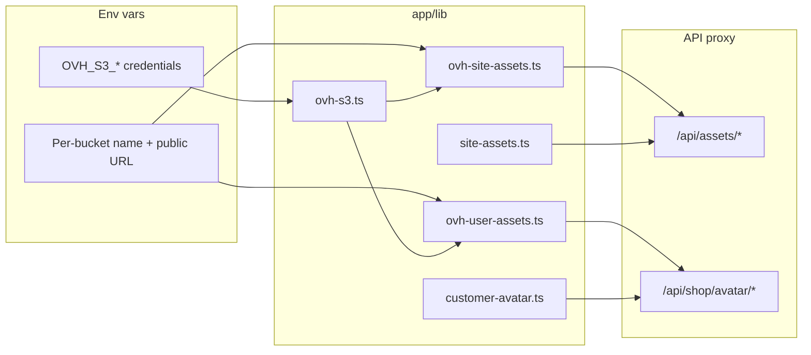

# Agent prompt: Implement OVH S3-compatible object storage (same pattern as dragonspurr-web)

Implement S3-compatible object storage for this Next.js app using the same architecture as the **dragonspurr-web** reference project. Use **OVH Object Storage** (S3-compatible API) with the AWS SDK v3, not the legacy AWS SDK.

## Goals

1. **Shared S3 client** — one set of credentials, multiple buckets.
2. **Domain modules** — separate helpers per bucket/use case (e.g. user uploads vs static site assets).
3. **Same-origin proxy routes** — serve objects through Next.js API routes instead of exposing bucket credentials or relying on public bucket URLs in the UI.
4. **Strict object-key validation** — block path traversal and unexpected keys before any S3 call.
5. **Graceful degradation** — feature-gate uploads/display when env vars are missing.

---

## 1. Dependencies

Add:

```json
"@aws-sdk/client-s3": "^3.x"
```

---

## 2. Environment variables

Document these in `.env.example` (values are placeholders; adapt bucket names and URLs to this project):

```bash
# OVH S3-compatible object storage (shared credentials for all buckets)
# OVH_S3_ENDPOINT=https://s3.ca-east-tor.io.cloud.ovh.net
# OVH_S3_REGION=ca-east-tor
# OVH_S3_ACCESS_KEY=
# OVH_S3_SECRET_KEY=

# User assets bucket (e.g. profile photos)
# OVH_USER_ASSETS_S3_BUCKET=your-user-assets-bucket
# OVH_USER_ASSETS_PUBLIC_URL=https://your-user-assets-bucket.s3.ca-east-tor.io.cloud.ovh.net

# Site assets bucket (logos, static images)
# OVH_SITE_ASSETS_S3_BUCKET=your-site-assets-bucket
# OVH_SITE_ASSETS_PUBLIC_URL=https://your-site-assets-bucket.s3.ca-east-tor.io.cloud.ovh.net
```

Pattern:

- **Shared credentials**: `OVH_S3_ENDPOINT`, `OVH_S3_REGION` (default `ca-east-tor`), `OVH_S3_ACCESS_KEY`, `OVH_S3_SECRET_KEY`
- **Per-bucket**: `{PREFIX}_S3_BUCKET` and `{PREFIX}_PUBLIC_URL` (canonical HTTPS origin for that bucket)

All env reads should `.trim()` values.

---

## 3. Core S3 module (`app/lib/ovh-s3.ts`)

Create a thin core module with:

| Function | Purpose |
|---|---|
| `getOvhS3Credentials()` | Read endpoint, region, access key, secret from env |
| `isOvhS3Configured()` | `true` when endpoint + both keys are set |
| `getOvhUserAssetsBucket()` / `getOvhSiteAssetsBucket()` | Per-bucket name from env |
| `isOvhUserAssetsConfigured()` / `isOvhSiteAssetsConfigured()` | S3 configured **and** bucket name set |
| `createOvhS3Client()` | Return `new S3Client({ region, endpoint, credentials, forcePathStyle: false })`; throw if credentials missing |

Use `forcePathStyle: false` (virtual-hosted-style URLs).

---

## 4. Per-bucket S3 modules

### User assets (`app/lib/ovh-user-assets.ts`) — read + write

- Re-export `isOvhUserAssetsConfigured`
- **`uploadCustomerAvatarToOvh(customerId, body: Uint8Array, contentType)`**:
  - Validate bucket configured
  - Derive file extension from allowed MIME types
  - Build object key (see key conventions below)
  - `PutObjectCommand` with `ContentType`, `CacheControl: 'public, max-age=31536000, immutable'`
  - Try `ACL: 'public-read'` first; on failure, retry without ACL (some providers reject ACL)
  - Return canonical public URL via `buildPublicObjectUrl(key)`
- **`getOvhUserAsset(objectKey)`**:
  - Validate key with allowlist helper
  - `GetObjectCommand`, return `{ body: Uint8Array, contentType }`

### Site assets (`app/lib/ovh-site-assets.ts`) — read only

- Re-export `isOvhSiteAssetsConfigured`
- **`getOvhSiteAsset(objectKey)`** — same GetObject pattern with site-asset key validation

---

## 5. URL and key helper modules

### User avatars (`app/lib/customer-avatar.ts`)

- `DEFAULT_PUBLIC_BASE` — hardcoded fallback matching the bucket's public URL
- `getAvatarPublicBaseUrl()` — env override or default, strip trailing slash
- Allowed MIME → extension map: `jpeg`, `png`, `webp`, `gif`
- `AVATAR_MAX_BYTES = 2 * 1024 * 1024`
- `buildCustomerAvatarObjectKey(customerId, extension)` → `avatars/{sanitizedId}/{timestamp}.{ext}` (sanitize ID to `[a-zA-Z0-9_-]`)
- `buildPublicObjectUrl(objectKey)` — encode path segments, prepend public base URL
- `isAllowedAvatarObjectKey(key)` — regex: `^avatars/[a-zA-Z0-9_-]+/[0-9]+\.(jpg|jpeg|png|webp|gif)$`
- `isAllowedAvatarUrl(url)` — HTTPS, origin matches public base, path starts with `/avatars/`
- `getCustomerAvatarProxyUrl(customer)` — stored metadata URL → same-origin proxy URL `/api/shop/avatar/{encodedKey}`

**Important:** Store the **canonical S3 public URL** in metadata; display via the **proxy URL** in the UI.

### Site assets (`app/lib/site-assets.ts`)

- `SITE_ASSETS_PROXY_BASE = '/api/assets'`
- `getSiteAssetsPublicBaseUrl()` — env override or default
- `buildSiteAssetUrl(objectKey)` → `{SITE_ASSETS_PROXY_BASE}/{encodedKey}` (always same-origin proxy, not direct S3)
- `isAllowedSiteAssetObjectKey(key)`:
  - Reject empty, `..`, leading `/`
  - Allow `brand/[a-zA-Z0-9._-]+`
  - Allow root-level `[a-zA-Z0-9._-]+\.(jpg|jpeg|png|webp|gif|svg)`

---

## 6. Next.js API proxy routes

Create catch-all GET handlers:

### `app/api/assets/[...objectKey]/route.ts` (site assets)

1. If `!isOvhSiteAssetsConfigured()` → `503 Not configured`
2. Join/decode path segments into `objectKey`
3. If `!isAllowedSiteAssetObjectKey(objectKey)` → `404`
4. `getOvhSiteAsset(objectKey)` → stream body with `Content-Type` and `Cache-Control: public, max-age=86400, immutable`
5. On error → `404` (don't leak S3 errors)

### `app/api/shop/avatar/[...objectKey]/route.ts` (user avatars)

Same pattern with avatar key validation and `Cache-Control: public, max-age=3600`.

Use `Buffer.from(asset.body)` in the `Response`.

---

## 7. Next.js image config (`next.config.ts`)

Add `images.remotePatterns` for each bucket's public hostname (and any CDN aliases), e.g.:

```ts
{
  protocol: 'https',
  hostname: 'your-site-assets-bucket.s3.ca-east-tor.io.cloud.ovh.net',
  pathname: '/**',
}
```

Repeat for user-assets and any CDN domains.

---

## 8. Upload integration (server action pattern)

In a server action (e.g. `uploadCustomerAvatarAction`):

1. Guard: backend auth configured, `isOvhUserAssetsConfigured()`, user signed in
2. Validate file present, size ≤ `AVATAR_MAX_BYTES`, MIME in allowlist
3. `new Uint8Array(await file.arrayBuffer())`
4. Call `uploadCustomerAvatarToOvh(customerId, body, file.type)`
5. Persist returned URL in user/customer metadata (e.g. `avatar_url`)
6. Revalidate affected paths

Gate upload UI with `isOvhUserAssetsConfigured()` so the feature is hidden/disabled when storage isn't set up.

---

## 9. Display integration

- **Avatars in UI:** use `getCustomerAvatarProxyUrl(customer)`, not the raw stored S3 URL
- **Static brand/site images:** use `buildSiteAssetUrl('brand/logo.png')` from a constants module
- **`<Image>` components:** proxy URLs work same-origin; remote patterns cover direct S3 URLs if needed

---

## 10. Tests

Add unit tests for:

- `buildSiteAssetUrl` → same-origin proxy paths
- `isAllowedSiteAssetObjectKey` → allow valid keys, reject traversal and wrong prefixes
- `isAllowedAvatarUrl` → accept bucket URLs under `/avatars/`, reject external URLs
- `getCustomerAvatarProxyUrl` → metadata URL → `/api/shop/avatar/...`
- `buildPublicObjectUrl` → correct encoded public URL

No live S3 calls in unit tests.

---

## 11. Security checklist

- Never expose access keys to the client
- Validate object keys with strict regex before every GetObject
- Reject `..` and leading `/` in keys
- Allowlist stored avatar URLs by origin + path prefix
- Return generic 404/503 from proxy routes
- Sanitize user IDs when building object keys

---

## 12. File layout (reference)

```
app/lib/
  ovh-s3.ts              # shared client + env
  ovh-user-assets.ts     # user bucket upload/get
  ovh-site-assets.ts     # site bucket get
  customer-avatar.ts     # avatar keys, URLs, validation
  site-assets.ts         # site asset URLs, validation
app/api/
  assets/[...objectKey]/route.ts
  shop/avatar/[...objectKey]/route.ts
__tests__/app/lib/
  customer-avatar.test.ts
  site-assets.test.ts
```

---

## Adaptation notes for the target project

Replace dragonspurr-specific names (`dp-assets`, `dp-user-assets`, Medusa customer metadata, etc.) with this project's bucket names, metadata store, and auth model. Keep the **layering** (core client → bucket module → domain helpers → proxy routes → server actions) and the **proxy-over-direct-URL** display pattern.

If this project only needs one bucket or only reads (no uploads), still create `ovh-s3.ts` and one bucket module; omit upload helpers and the avatar route if unused.

---

## Reference implementation

The full reference lives in **dragonspurr-web** at:

- `app/lib/ovh-s3.ts`
- `app/lib/ovh-user-assets.ts`, `app/lib/ovh-site-assets.ts`
- `app/lib/customer-avatar.ts`, `app/lib/site-assets.ts`
- `app/api/assets/[...objectKey]/route.ts`, `app/api/shop/avatar/[...objectKey]/route.ts`
- `.env.example` (OVH section)
- `next.config.ts` (`images.remotePatterns`)

Match behavior and structure; adapt naming and integrations to the target codebase.

---

## Quick mental model



**Upload path:** Server action → `uploadCustomerAvatarToOvh` → S3 PutObject → store public URL in metadata

**Display path:** Metadata URL → `getCustomerAvatarProxyUrl` / `buildSiteAssetUrl` → same-origin API route → S3 GetObject → browser
