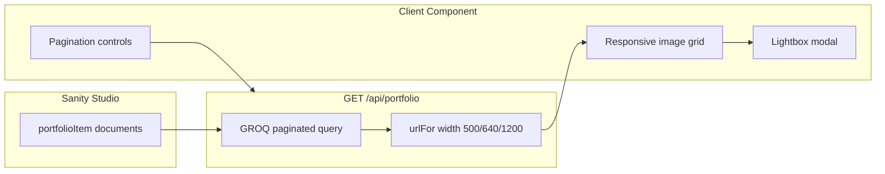

# Agent prompt: Implement Portfolio page (same pattern as dragonspurr-web)

Implement a paginated photo gallery for this Next.js app using the same architecture as the **dragonspurr-web** reference project. Portfolio items are authored in **Sanity**, fetched via a **Next.js API route**, and rendered in a **Client Component** with grid pagination and a lightbox modal.

## Goals

1. **Sanity CMS** — `portfolioItem` documents with image, title, and description.
2. **API route pagination** — `GET /api/portfolio?page=N` returns 18 items per page with multiple image sizes.
3. **Client Component gallery** — fetch on mount/page change, skeleton loading, error states.
4. **Lightbox modal** — click to enlarge; keyboard navigation (Escape, arrows); prev/next within page.
5. **Responsive grid** — 2–6 columns depending on viewport.
6. **Graceful degradation** — API returns 503 when Sanity is unconfigured.

---

## 1. Dependencies

```json
"next-sanity": "^12.x",
"@sanity/image-url": "^2.x",
"sanity": "^5.x",
"@iconify/react": "^6.x",
"@iconify/types": "^3.x"
```

Shared Sanity client in `app/lib/sanity.ts` (same as About page pattern).

---

## 2. Environment variables

```bash
# NEXT_PUBLIC_SANITY_PROJECT_ID="xxxxxxx"
# NEXT_PUBLIC_SANITY_DATASET="production"
```

Uses `isSanityConfigured()` from `app/lib/sanity.ts`.

Ensure `next.config.ts` includes `cdn.sanity.io` in `images.remotePatterns`.

---

## 3. Sanity schema (`sanity/schemas/portfolioItem.ts`)

Document type `portfolioItem` (collection, not singleton):

| Field | Type | Notes |
|---|---|---|
| `title` | `string` | Caption / alt text |
| `image` | `image` | Required for display; hotspot enabled |
| `description` | `text` | Shown in modal caption |
| `url` | `url` (optional) | External "View project" link in modal |

Reference schema in dragonspurr-web includes `title`, `image`, `description`. The API also queries `url` for an optional project link — add a `url` field to the schema if you want "View project →" links in the modal.

```ts
export const portfolioItem = {
  name: 'portfolioItem',
  title: 'Portfolio Item',
  type: 'document',
  fields: [
    { name: 'title', title: 'Title', type: 'string' },
    { name: 'image', title: 'Image', type: 'image', options: { hotspot: true } },
    { name: 'description', title: 'Description', type: 'text' },
    { name: 'url', title: 'Project URL', type: 'url' }, // optional
  ],
  preview: {
    select: { title: 'title', media: 'image' },
    prepare({ title, media }) {
      return { title: title || 'Untitled', media };
    },
  },
};
```

Register in `sanity/schemas/index.ts`. No singleton structure needed — portfolio items appear in the default document list in Studio.

---

## 4. API route (`app/api/portfolio/route.ts`)

### Constants

```ts
const PER_PAGE = 18;
```

### GROQ queries

```groq
// Total count
count(*[_type == "portfolioItem"])

// Paginated page (newest first)
*[_type == "portfolioItem"] | order(_createdAt desc) [$start...$end] {
  _id,
  title,
  description,
  url,
  "image": image
}
```

### GET handler

```ts
export async function GET(request: NextRequest) {
  if (!isSanityConfigured()) {
    return Response.json({ error: 'Sanity is not configured...' }, { status: 503 });
  }

  const page = Math.max(1, parseInt(searchParams.get('page') || '1', 10));
  const start = (page - 1) * PER_PAGE;
  const end = start + PER_PAGE;

  const [total, items] = await Promise.all([
    sanityClient.fetch<number>(PORTFOLIO_GROQ),
    sanityClient.fetch<PortfolioItem[]>(PORTFOLIO_PAGE_GROQ, { start, end }),
  ]);

  const pages = Math.ceil((total || 0) / PER_PAGE) || 1;
  const photos = items.map((item) => {
    const imageUrl = item.image ? urlFor(item.image) : null;
    return {
      id: item._id,
      title: item.title || '',
      description: item.description || '',
      url: item.url || null,
      urlMedium: imageUrl ? imageUrl.width(500).url() : null,
      urlLarge: imageUrl ? imageUrl.width(640).url() : null,
      urlModal: imageUrl ? imageUrl.width(1200).url() : null,
    };
  });

  return Response.json({ photos, page, pages, total, perPage: PER_PAGE });
}
```

### Response shape

```ts
{
  photos: Array<{
    id: string;
    title: string;
    description: string;
    url: string | null;
    urlMedium: string | null;
    urlLarge: string | null;
    urlModal: string | null;
  }>;
  page: number;
  pages: number;
  total: number;
  perPage: 18;
}
```

### Error handling

- `503` — Sanity not configured
- `502` — Sanity fetch failed (return `{ error: message }`)

---

## 5. Icon components

### Pagination arrows (`components/icons/boxicons-cart.ts` or dedicated file)

Bundle outline + filled variants for hover swap:

- `boxiconsArrowBigLeft` / `boxiconsArrowBigLeftFilled`
- `boxiconsArrowBigRight` / `boxiconsArrowBigRightFilled`

### Hover button (`components/icons/BoxIconHoverButton.tsx`)

Client component that swaps outline/filled icon on hover:

```tsx
'use client';

export function BoxIconHoverButton({ icon, filledIcon, label, disabled, onClick, className, iconSize }) {
  return (
    <button type="button" disabled={disabled} onClick={onClick} aria-label={label} className="group ...">
      <BoxIcon icon={icon} className="group-hover:hidden" />
      <BoxIcon icon={filledIcon} className="hidden group-hover:block" />
    </button>
  );
}
```

---

## 6. Page component (`app/portfolio/page.tsx`)

**Client Component** (`'use client'`).

### State

```ts
const PHOTOS_PER_PAGE = 18;

interface PortfolioPhoto {
  id: string;
  title: string;
  description: string;
  url: string | null;
  urlMedium: string | null;
  urlLarge: string | null;
  urlModal: string | null;
}

const [data, setData] = useState<PortfolioData>({ photos: [], page: 1, pages: 0, total: 0 });
const [page, setPage] = useState(1);
const [loading, setLoading] = useState(true);
const [error, setError] = useState<string | null>(null);
const [modalPhoto, setModalPhoto] = useState<PortfolioPhoto | null>(null);
```

### Data fetching

```ts
useEffect(() => {
  setLoading(true);
  setError(null);
  fetch(`/api/portfolio?page=${page}`)
    .then((res) => {
      if (!res.ok) return res.json().then((body) => Promise.reject(new Error(body.error || res.statusText)));
      return res.json();
    })
    .then(setData)
    .catch((err) => setError(err.message))
    .finally(() => setLoading(false));
}, [page]);
```

### Grid layout

Responsive columns:

```
grid-cols-2 sm:grid-cols-3 md:grid-cols-4 lg:grid-cols-5 xl:grid-cols-6
```

Each cell:

- Square aspect ratio (`aspect-square`)
- Rounded corners, dark background placeholder
- `next/image` with `urlMedium`, lazy loading, hover scale
- Button wrapper with `aria-label` ("View {title}")
- Optional figcaption with title (also opens modal)

### Loading skeleton

18 pulsing placeholder squares matching grid layout (`animate-pulse`).

### Pagination

Shown when `data.pages > 1`:

- Previous/Next `BoxIconHoverButton` (disabled at boundaries)
- "Page X of Y (Z photos)" text
- `setPage` updates trigger re-fetch

### Lightbox modal

When `modalPhoto` is set:

- Full-screen overlay (`fixed inset-0 z-50 bg-black/90`)
- Click overlay to close; click content to stop propagation
- Close button (×) with `aria-label="Close modal"`
- Large image: `urlModal ?? urlLarge ?? urlMedium`
- Title (`h2`, brand accent color) + description
- Optional "View project →" link (`target="_blank" rel="noreferrer"`)
- Prev/next arrows within current page's photos
- Keyboard: `Escape` closes, `ArrowLeft`/`ArrowRight` navigate
- `document.body.style.overflow = 'hidden'` while open

Dialog attributes: `role="dialog"`, `aria-modal="true"`, `aria-labelledby`, `aria-describedby`.

---

## 7. Navigation

```ts
{ href: '/portfolio', label: 'Portfolio' }
```

No portfolio-specific layout file.

---

## 8. Tests

### `__tests__/app/portfolio/page.test.tsx`

Mock `global.fetch` to return API JSON.

Test cases:

1. **Fetches and displays** — calls `/api/portfolio?page=1`, renders image alt text
2. **Pagination** — shows "Page 1 of 2", prev/next buttons
3. **Modal open** — click photo button → dialog with title and description
4. **Project link** — modal shows "View project" link when `url` is set

Example fetch mock:

```ts
global.fetch = jest.fn(() =>
  Promise.resolve({
    ok: true,
    json: () => Promise.resolve(mockPhotosResponse),
  })
) as jest.Mock;
```

### Links smoke test

Include `/portfolio` in site-wide route coverage. Portfolio page content has no in-page links unless photos have `url` set (external project links in modal only).

---

## 9. File layout (reference)

```
app/
  portfolio/page.tsx            # Client Component gallery
  api/portfolio/route.ts        # Paginated Sanity API
  lib/sanity.ts                 # shared client, urlFor, isSanityConfigured
sanity/
  schemas/portfolioItem.ts
  schemas/index.ts
components/
  icons/BoxIcon.tsx
  icons/BoxIconHoverButton.tsx
  icons/boxicons-cart.ts        # arrow icons (or dedicated file)
__tests__/
  app/portfolio/page.test.tsx
```

---

## Adaptation notes for the target project

- Change `PER_PAGE` if you want a different grid density.
- Add filtering by category/tag in GROQ if the target portfolio needs taxonomy.
- Consider Server Component + `searchParams` pagination instead of client fetch if SEO for paginated URLs matters.
- Add `url` field to Sanity schema if "View project" links are needed (API already supports it).
- Swap Boxicons for your icon set; keep the outline/filled hover pattern for pagination.

---

## Reference implementation

The full reference lives in **dragonspurr-web** at:

- `app/portfolio/page.tsx`
- `app/api/portfolio/route.ts`
- `sanity/schemas/portfolioItem.ts`
- `app/lib/sanity.ts`
- `components/icons/BoxIconHoverButton.tsx`
- `components/icons/boxicons-cart.ts`
- `__tests__/app/portfolio/page.test.tsx`

Match behavior and structure; adapt schema fields, grid density, and styling to the target codebase.

---

## Quick mental model



**Authoring path:** Editor adds portfolio items in Studio → publish

**Render path:** `/portfolio` → client fetch `/api/portfolio?page=1` → grid → click opens modal

**Pagination path:** Next page button → `setPage(2)` → re-fetch → new grid
