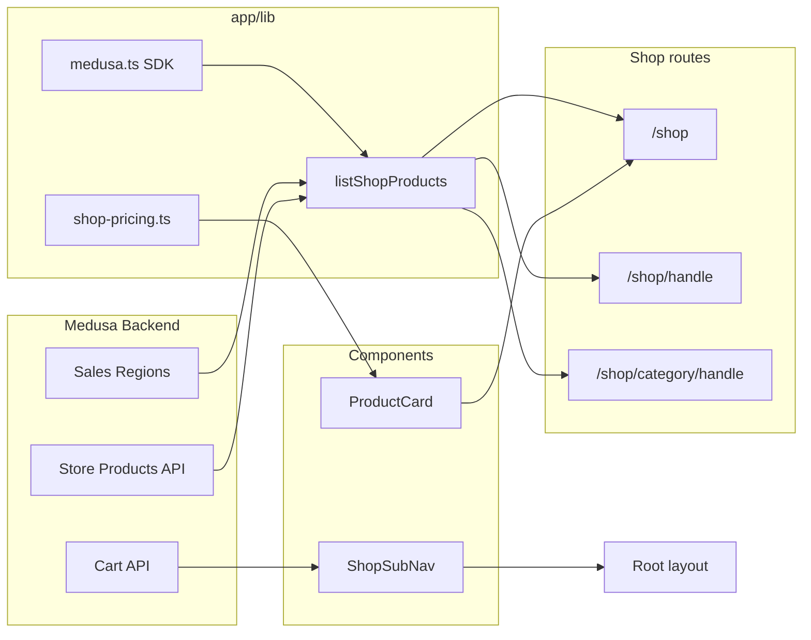

# Agent prompt: Implement Shop pages (same pattern as dragonspurr-web)

Implement a Medusa-powered storefront for this Next.js app using the same architecture as the **dragonspurr-web** reference project. Products come from a **Medusa v2** backend via `@medusajs/js-sdk`. The shop listing page is a Server Component; cart, checkout, and account flows use server actions and client components.

## Goals

1. **Medusa Store API** — products, categories, cart, and customer auth via JS SDK.
2. **Server Component listing** — `/shop` fetches products server-side with region-aware pricing.
3. **Result discriminated unions** — `{ ok: true, ... } | { ok: false, error, code }` for graceful error UI.
4. **Product grid** — reusable `ProductCard` linking to `/shop/[handle]`.
5. **Shop sub-navigation** — category dropdown, cart, and account in a secondary nav bar.
6. **Fixed locale pricing** — `en-CA` `Intl.NumberFormat` to avoid hydration mismatches.
7. **Dynamic shop routes** — `force-dynamic` layout so cart/auth state stays fresh.

---

## 1. Dependencies

```json
"@medusajs/js-sdk": "^2.x",
"@medusajs/types": "^2.x",
"@stripe/react-stripe-js": "^6.x",
"@stripe/stripe-js": "^9.x"
```

---

## 2. Environment variables

Document in `.env.example`:

```bash
# Medusa Store API
# MEDUSA_BACKEND_URL=https://your-medusa-backend.example.com
# MEDUSA_PUBLISHABLE_KEY=pk_...
# NEXT_PUBLIC_MEDUSA_BACKEND_URL=http://localhost:9000
# NEXT_PUBLIC_MEDUSA_PUBLISHABLE_KEY=pk_...

# Stripe (must match Medusa backend; enable Stripe on the region in Medusa Admin)
# NEXT_PUBLIC_STRIPE_PUBLISHABLE_KEY=pk_test_...
```

Pattern:

- `MEDUSA_BACKEND_URL` or `NEXT_PUBLIC_MEDUSA_BACKEND_URL` (default `http://localhost:9000`)
- `MEDUSA_PUBLISHABLE_KEY` or `NEXT_PUBLIC_MEDUSA_PUBLISHABLE_KEY` — required for `isMedusaConfigured()`
- `NEXT_PUBLIC_STRIPE_PUBLISHABLE_KEY` — checkout payment element

Create publishable API keys in Medusa Admin → Settings → Publishable API Keys.

---

## 3. Medusa SDK setup (`app/lib/medusa.ts`)

```ts
import Medusa, { FetchError } from '@medusajs/js-sdk';

const MEDUSA_BACKEND_URL =
  readEnv('MEDUSA_BACKEND_URL', 'NEXT_PUBLIC_MEDUSA_BACKEND_URL') ?? 'http://localhost:9000';

export const medusaPublishableKey = readEnv(
  'MEDUSA_PUBLISHABLE_KEY',
  'NEXT_PUBLIC_MEDUSA_PUBLISHABLE_KEY'
);

export const sdk = new Medusa({
  baseUrl: MEDUSA_BACKEND_URL,
  publishableKey: medusaPublishableKey,
  auth: { type: 'jwt', jwtTokenStorageMethod: 'memory' },
});

// Force no-store on SDK fetch (dynamic cart/auth)
sdk.client.fetch = (input, init) => medusaFetch(input, { cache: 'no-store', ...init });

export function isMedusaConfigured(): boolean {
  return Boolean(medusaPublishableKey);
}

export function formatMedusaError(err: unknown, fallback: string): string { /* ... */ }
```

### Cloudflare header stripping

If Medusa is behind Cloudflare, strip `cf-connecting-ip`, `cf-ipcountry`, `cf-visitor`, `cf-ray` from outbound SDK requests to avoid 403 errors when Vercel forwards those headers server-to-server. Patch `globalThis.fetch` for requests to the Medusa origin.

---

## 4. Region helper (`app/lib/medusa-region.ts`)

```ts
export async function getDefaultRegionId(): Promise<string | null> {
  if (!isMedusaConfigured()) return null;
  const { regions } = await sdk.store.region.list({ limit: 1 });
  return regions[0]?.id ?? null;
}
```

Product listing requires at least one sales region in Medusa Admin.

---

## 5. Shop data layer (`app/lib/shop.ts`)

### Types

```ts
export type ShopProductsResult =
  | { ok: true; products: HttpTypes.StoreProduct[]; count: number; regionId: string }
  | { ok: false; error: string; code: 'missing_config' | 'api_error' };

export type ShopCategoryNavItem = { id: string; name: string; handle: string };
```

### `listShopProducts(limit = 24, categoryId?: string)`

1. Guard: `isMedusaConfigured()` → `missing_config` error with setup instructions
2. `getDefaultRegionId()` → error if no regions
3. `sdk.store.product.list({ limit, region_id, category_id?, fields: '*variants.calculated_price' })`
4. Return `{ ok: true, products, count, regionId }` or `{ ok: false, code: 'api_error', error }`

### `listShopCategories()`

Fetch categories for shop sub-nav; return `[]` on failure (non-fatal).

### `retrieveShopProduct(handle)` / `retrieveShopCategoryByHandle(handle)`

For product detail and category pages.

---

## 6. Pricing (`app/lib/shop-pricing.ts`)

Use a **fixed locale** to prevent server/client hydration mismatches:

```ts
const SHOP_PRICE_LOCALE = 'en-CA';

export function formatVariantPrice(calculatedPrice): string | null {
  const amount = calculatedPrice?.calculated_amount;
  const currency = calculatedPrice?.currency_code;
  if (amount == null || !currency) return null;
  return new Intl.NumberFormat(SHOP_PRICE_LOCALE, {
    style: 'currency',
    currency: currency.toUpperCase(),
  }).format(amount);
}

export function getProductDisplayPrice(product): string | null {
  const prices = (product.variants ?? [])
    .map((v) => formatVariantPrice(v.calculated_price))
    .filter(Boolean);
  return prices[0] ?? null;
}
```

---

## 7. Shop listing page (`app/shop/page.tsx`)

Server Component with metadata:

```tsx
export const metadata: Metadata = {
  title: 'Shop',
  description: 'Browse products.',
};

export default async function ShopPage() {
  const result = await listShopProducts();

  return (
    <div className="container mx-auto w-full">
      <header className="mb-8 md:mb-12">
        <h1 className="dp-page-header">Shop</h1>
        <p className="dp-body-text max-w-3xl">
          Browse our latest products. Prices are shown for your region when available.
        </p>
      </header>

      {!result.ok ? (
        <div role="alert" className="rounded-lg border border-red-700 bg-red-900/40 ...">
          {result.error}
        </div>
      ) : result.products.length === 0 ? (
        <p className="dp-body-text">No products are available yet. Add products in Medusa Admin.</p>
      ) : (
        <>
          <p className="font-cormorant_garamond text-lg text-gray-300 mb-6">
            {result.count} {result.count === 1 ? 'product' : 'products'}
          </p>
          <div className="grid grid-cols-1 sm:grid-cols-2 md:grid-cols-3 lg:grid-cols-4 gap-6 md:gap-8 min-w-0">
            {result.products.map((product) => (
              <ProductCard key={product.id} product={product} />
            ))}
          </div>
        </>
      )}
    </div>
  );
}
```

### Error states

| Condition | UI |
|---|---|
| Medusa not configured | Alert with env var setup instructions |
| API error | Alert with `formatMedusaError` message |
| Empty catalog | Friendly empty-state message |

---

## 8. Product card (`components/shop/ProductCard.tsx`)

```tsx
export function ProductCard({ product }: { product: HttpTypes.StoreProduct }) {
  const price = getProductDisplayPrice(product);
  const href = `/shop/${product.handle}`;

  return (
    <article className="min-w-0 flex flex-col">
      <Link href={href} className="block aspect-square rounded-lg bg-gray-800/60 overflow-hidden ...">
        {product.thumbnail ? (
          <Image src={product.thumbnail} alt={product.title} className="object-cover hover:scale-105 ..." width={500} height={500} />
        ) : (
          <div>No image</div>
        )}
      </Link>
      <div className="mt-3 space-y-1">
        <h2 className="font-cinzel text-lg md:text-xl">
          <Link href={href} className="text-white hover:text-red-600">{product.title}</Link>
        </h2>
        {price && <p className="font-cormorant_garamond text-xl text-gray-300">{price}</p>}
        {product.description && <p className="line-clamp-2 text-gray-400">{product.description}</p>}
      </div>
    </article>
  );
}
```

---

## 9. Related shop routes (same patterns)

### Category page (`app/shop/category/[handle]/page.tsx`)

- `retrieveShopCategoryByHandle(handle)` → `notFound()` if missing
- `listShopProducts(24, category.id)` → same grid as main shop
- Breadcrumb link "← All products" to `/shop`

### Product detail (`app/shop/[handle]/page.tsx`)

- `retrieveShopProduct(handle)` → `notFound()` or error alert
- Two-column layout: image + title, price, description
- `<ProductPurchase product={product} />` — variant selector + add to cart (client component)
- `generateMetadata` from product title/description

### Shop layout (`app/shop/layout.tsx`)

```ts
export const dynamic = 'force-dynamic';

export default function ShopLayout({ children }) {
  return children;
}
```

---

## 10. Shop sub-navigation

### Root layout data fetching (`app/layout.tsx`)

```ts
const [shopCategories, cart, customer] = await Promise.all([
  listShopCategories(),
  getShopCartNavPreview(),
  retrieveLoggedInCustomer(),
]);
```

Pass to `LayoutSwitcher` → `ShopSubNav` when `pathname.startsWith('/shop')`.

### `components/shop/ShopSubNav.tsx`

Client component with:

- **Browse** dropdown → `/shop` + `/shop/category/{handle}` links
- **Cart** dropdown preview
- **Account** dropdown (login/signup or account/orders)
- Styling: `bg-[var(--dp-dark-red)]` bar below main nav

### `components/Navigation.tsx`

Main nav includes `{ href: '/shop', label: 'Shop' }`.

---

## 11. Cart and checkout (ecosystem overview)

Beyond the listing page, the reference shop includes:

| Route | Purpose |
|---|---|
| `/shop/cart` | Cart view |
| `/shop/checkout` | Stripe payment + shipping |
| `/shop/login`, `/shop/signup` | Customer auth |
| `/shop/account` | Profile, addresses, avatar upload |
| `/shop/orders` | Order history |
| `app/shop/actions.ts` | Server actions (add to cart, checkout, auth, avatar) |
| `app/api/shop/capture-payment/[cartId]/route.ts` | Payment capture webhook |

Implement listing first; add cart/checkout as follow-up using the same Medusa SDK and server action patterns.

---

## 12. Image config (`next.config.ts`)

Add Medusa image hostnames to `images.remotePatterns`:

```ts
{ protocol: 'https', hostname: 'your-medusa-cdn.example.com', pathname: '/**' },
{ protocol: 'http', hostname: 'localhost', port: '9000', pathname: '/**' },
```

---

## 13. Tests

### `__tests__/app/shop/page.test.tsx`

Mock `listShopProducts`.

Test cases:

1. **Not configured** — `ok: false, code: 'missing_config'` → alert with error text
2. **Product grid** — `ok: true` with mock product → heading, link to `/shop/{handle}`, formatted price

```ts
render(await ShopPage()); // async Server Component
expect(screen.getByRole('link', { name: /dragon mug/i })).toHaveAttribute('href', '/shop/dragon-mug');
expect(screen.getByText('CA$19.99')).toBeInTheDocument(); // locale-dependent
```

### Links smoke test

Include `/shop` in site-wide route coverage.

---

## 14. File layout (reference)

```
app/
  shop/
    page.tsx                      # Product listing (this prompt's focus)
    layout.tsx                    # force-dynamic
    [handle]/page.tsx             # Product detail
    category/[handle]/page.tsx    # Category listing
    cart/page.tsx
    checkout/page.tsx
    login/page.tsx
    signup/page.tsx
    account/page.tsx
    orders/page.tsx
    actions.ts                    # Server actions
  lib/
    medusa.ts                     # SDK + isMedusaConfigured
    medusa-region.ts              # getDefaultRegionId
    shop.ts                       # listShopProducts, categories
    shop-pricing.ts               # formatVariantPrice
    medusa-cart.ts                # Cart preview for nav
    medusa-auth.ts                # Customer session
components/shop/
  ProductCard.tsx
  ProductPurchase.tsx
  AddToCartButton.tsx
  ShopSubNav.tsx
  CartNavDropdown.tsx
  AccountNavDropdown.tsx
  CheckoutForm.tsx
  ...
__tests__/app/shop/page.test.tsx
```

---

## Adaptation notes for the target project

- Ensure Medusa Admin has products, at least one region, and a publishable API key before testing.
- Match `SHOP_PRICE_LOCALE` to your primary market.
- Category and product pages reuse `ProductCard` and `listShopProducts` — implement them together with the listing page.
- If not using Stripe, skip checkout components but keep the listing/detail pattern.
- Cloudflare header stripping is specific to server-to-server Medusa deployments behind Cloudflare — skip if not applicable.

---

## Reference implementation

The full reference lives in **dragonspurr-web** at:

- `app/shop/page.tsx` — listing page
- `app/shop/[handle]/page.tsx`, `app/shop/category/[handle]/page.tsx`
- `app/shop/layout.tsx`, `app/shop/actions.ts`
- `app/lib/medusa.ts`, `app/lib/shop.ts`, `app/lib/shop-pricing.ts`, `app/lib/medusa-region.ts`
- `components/shop/ProductCard.tsx`, `components/shop/ShopSubNav.tsx`
- `app/layout.tsx` (shop categories + cart in layout)
- `app/LayoutSwitcher.tsx` (shop sub-nav)
- `__tests__/app/shop/page.test.tsx`
- `.env.example` (Medusa section)

Match behavior and structure; adapt Medusa backend URL, styling, and checkout provider to the target codebase.

---

## Quick mental model



**Listing path:** `/shop` → `listShopProducts()` → Medusa product.list with region_id → ProductCard grid

**Detail path:** `/shop/{handle}` → `retrieveShopProduct()` → image + ProductPurchase → add to cart server action

**Nav path:** Root layout fetches categories + cart → ShopSubNav on all `/shop/*` routes
